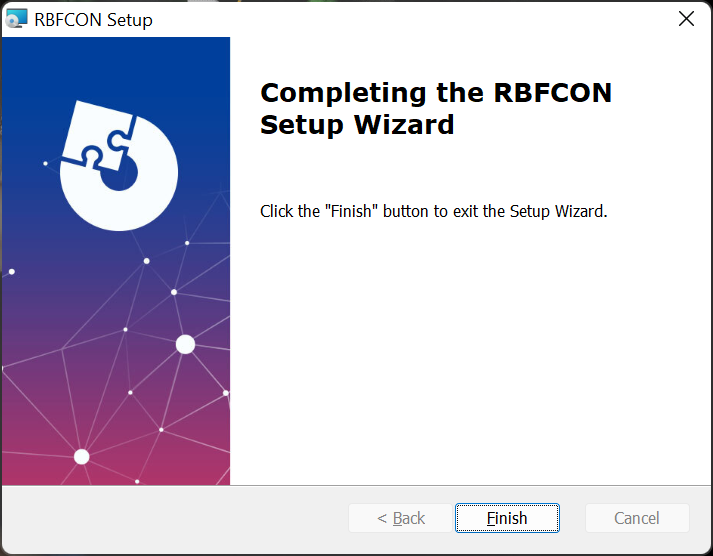

# The RbfCon software
This projects proposes a software tool written in ANSI C+ for classification and regression problems.This software produces RBF neural networks with the assistance of the Grammatical Evolution procedure.
#  Requirements
1. A C++ compiler (GNU GCC is recommended).
2. The GNU make utility
3. The QT programming library.
## Linux/Openbsd installation
The steps to install the software in most Unix systems are
1. Download the Qt library (usually using the package manager of the distribution)
2. Unzip the software: gunzip RbfCon-master.zip
3. Issue the command: cd RbfCon-master
4. Issue the command: qmake (or qmake-qt5 in some systems)
5. Issue the command: make

## Windows installation
On Windows a simple solution for the installation could be the following steps:
1. Install the software installer Choco 
2. Issue the command: choco install make
3. Issue the command: choco install mingw
4. Install the Qt library
4. Unzip the software
5. Issue the command cd RbfCon-master
6. Issue the command qmake
7. Issue the command make

Alternatively, in Windows the user can use the added RBFCON.msi executable and execute it.

The steps of the installation are shown in Figure 1. The user needs to select only the desired installation directory and the installer copies the necessary files to this directory.

(a) First screen of the windows installation wizard.

(b) The user selects the desired installation directory

(c) Copying files.

(d) Finalizing installation.

**Figure 1.** The steps of windows installation

